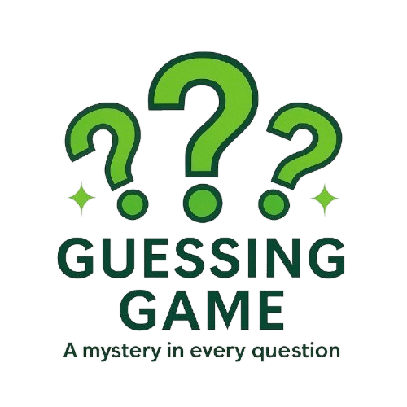
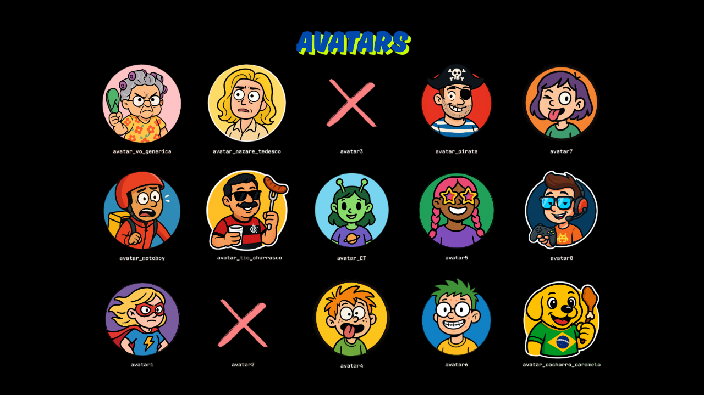

  

<h1 align="center">🎮 Guessing Game 🕹️</h1> 

## 📝 Descrição

Este jogo está sendo desenvolvido em **Java** e é uma versão interativa do clássico "O que é, o que é?". O jogador é desafiado com adivinhas divertidas ao longo de **6 fases**. Em cada fase, ele deve acertar um número de perguntas, com até **três tentativas por questão**.

Se errar todas as tentativas, o jogo termina e exibe a resposta correta. Caso o jogador acerte todas as perguntas até o final, é parabenizado com uma mensagem especial.

A interface gráfica foi criada com a biblioteca **libGDX**, proporcionando uma experiência visual envolvente e interativa.

---

## 🚀 Tecnologias Utilizadas

Este projeto utiliza as seguintes tecnologias:

- ☕ **Java**
- 🎮 **libGDX** (Biblioteca gráfica para jogos 2D/3D)
- 🛠️ IDEs recomendadas: **IntelliJ IDEA** ou **Eclipse**

---

## 📋 Pré-requisitos

Antes de executar o projeto, certifique-se de ter instalado:

- Java 8 ou superior
- libGDX configurado no seu ambiente
- IDE com suporte a Gradle e bibliotecas externas (como IntelliJ IDEA ou Eclipse)

---

## 🏗️ Padrões de Projeto

O projeto adota os seguintes padrões de design para promover escalabilidade e manutenção:

### 🔸 Facade
- Utilizado para fornecer uma **interface unificada** que centraliza e simplifica o acesso às funcionalidades principais do jogo.

### 🔸 Chain of Responsibility (CoR)
- Aplicado para organizar o **processamento da resposta do jogador** de forma desacoplada e flexível.
- Implementado na **classe** `GuessingGameScreen`, especificamente no **método** `verificarResposta()`, que dispara a cadeia de handlers.
- A cadeia é composta por classes como:
  - `VerifyAnswerHandler`
  - `UpdatePontuationHandler`
  - `ShowFeedbackHandler`
  - `AvancarPerguntaHandler`

Esses handlers são conectados em sequência e cada um executa sua lógica apenas se a condição definida for satisfeita, facilitando a extensão do jogo com novos comportamentos.

---

## ⚙️ Status do Projeto

🛠️ Em desenvolvimento. Novas funcionalidades estão sendo implementadas continuamente.

---

## 👩‍💻 Desenvolvedores

Este projeto está sendo desenvolvido por:

- [Renan Carvalho](https://github.com/RenanDev2578?tab=repositories)
- [Alessandra Lemos](https://github.com/SandyLemos?tab=repositories)

---

## 🎨 Screenshots

  

